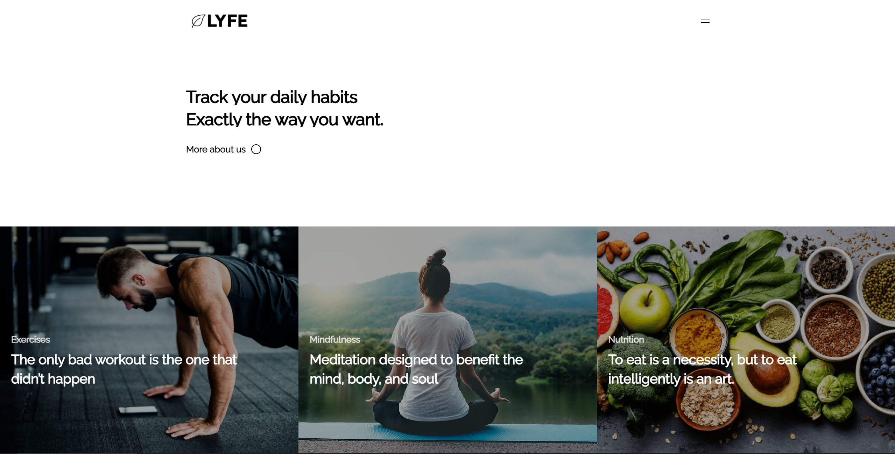
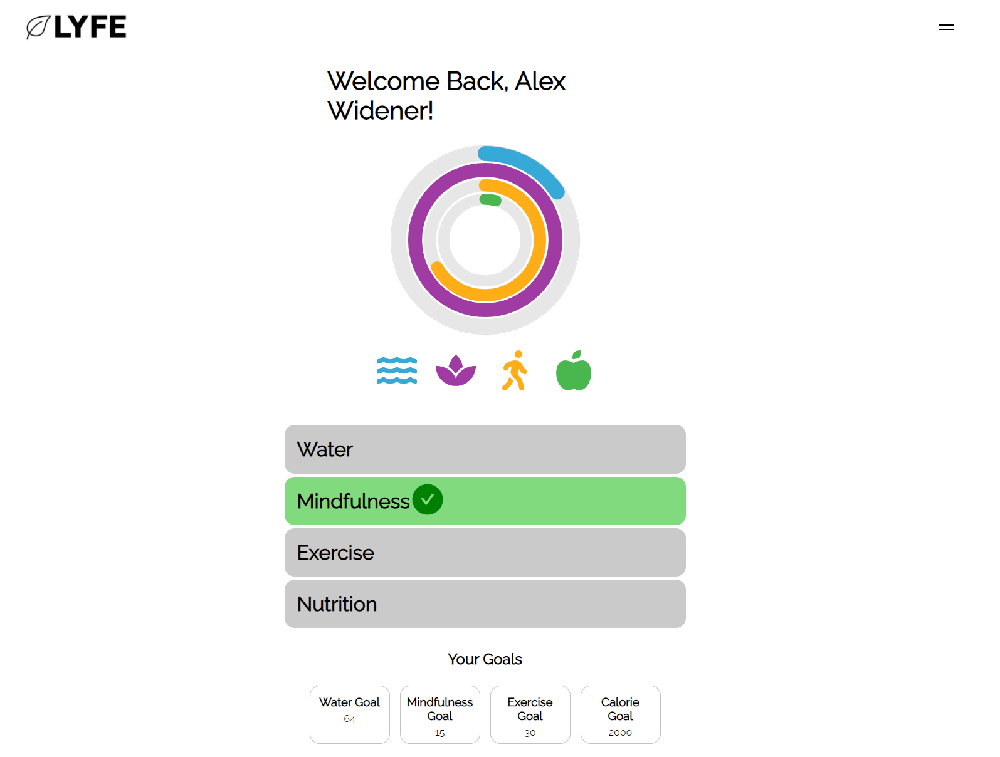
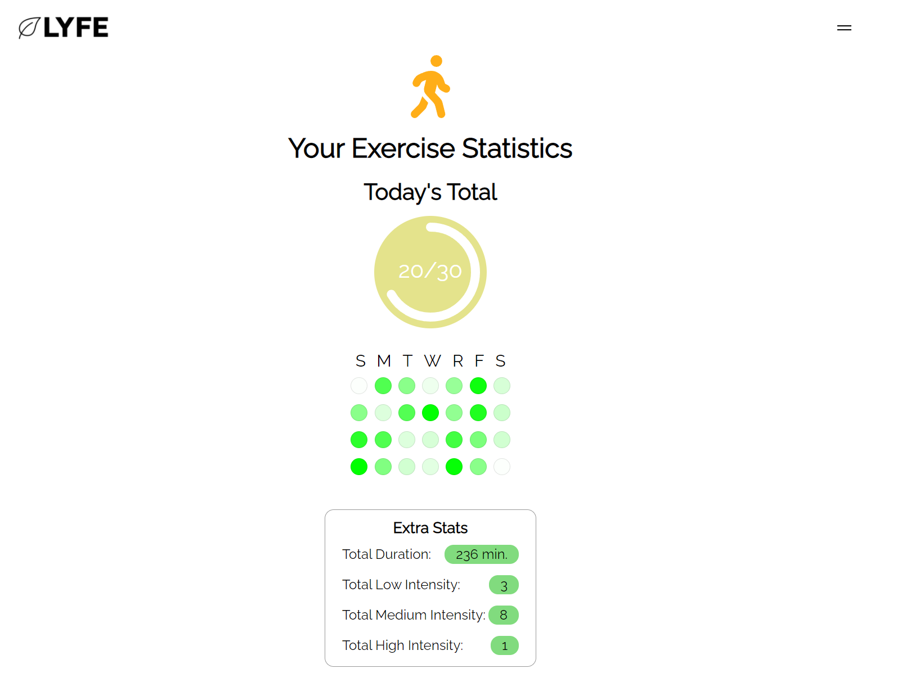
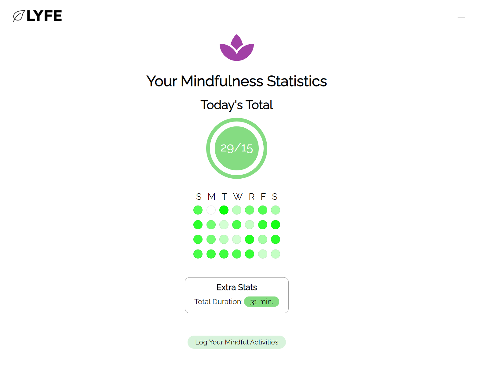
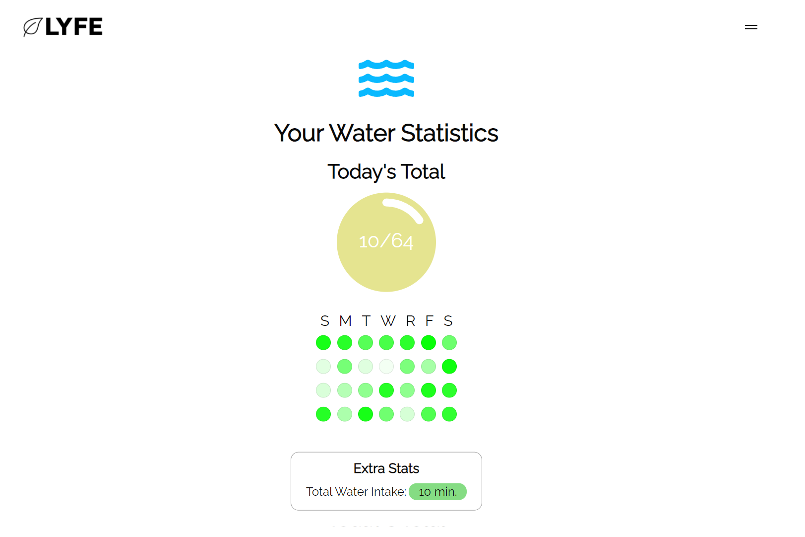

# 🍃 Lyfe
[Link to Deployed Application](https://lyfe22.herokuapp.com/)

📌[Link to Deployed Application](https://lyfe22.herokuapp.com/)

## Table of Contents
- [🍃 Lyfe](#-lyfe)
  - [Table of Contents](#table-of-contents)
  - [🔎 Overview](#-overview)
  - [💻 Technologies](#-technologies)
  - [🎨 Preview](#-preview)
  - [📝 Wireframe](#-wireframe)

## 🔎 Overview
Lyfe is a lifestyle tracker, allowing a user to track daily habits to lead towards a better life. The four main components of the Lyfe application are: Exercise, Mindfulness, Nutrition and Water. This four pillars will help you feel better and motivated to conquer every day life.

## 💻 Technologies

|              Frontend               |                 Backend                  |
| :---------------------------------: | :--------------------------------------: |
|                HTML                 |   [MongoDB](https://www.mongodb.com/)    |
|                 CSS                 |   [Mongoose](https://mongoosejs.com/)    |
|             JavaScript              |     [GraphQL](https://graphql.org/)      |
|    [React](https://reactjs.org/)    | [Apollo](https://www.apollographql.com/) |
| [GSAP](https://greensock.com/gsap/) |                                          |

## 🎨 Preview

## 📝 Wireframe
